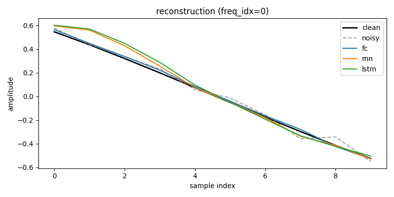

# Sine/Cosine Signal Denoising — Comparing FC, RNN, and LSTM

> Course: AI Agent Orchestration and Deep Learning — Homework 1.
> Author: Mohamed Awad.
> Repository: <https://github.com/mohammedawad99/signal-denoising-fc-rnn-lstm>.

## Abstract

We compare three neural-network architectures on a controlled signal-denoising task: a Fully Connected (FC) network, a vanilla Elman RNN, and an LSTM. Each model receives a 10-sample noisy window of a sinusoid, the one-hot identity of one of four known frequencies, and the noise level `sigma`, and must predict the corresponding 10 clean samples. All three are trained on identical data with the same loss (MSE), optimizer (Adam @ `lr=1e-3`), batch size, and schedule (30 epochs, early stopping with patience 5), so the only changing factor is the backbone family. On a held-out test set of 3,200 windows the FC achieves the lowest test MSE (0.00465) and the largest SNR improvement (+8.80 dB); the LSTM (0.01255 / +4.49 dB) modestly beats the vanilla RNN (0.01352 / +4.16 dB). All three models degrade gracefully with the noise level and produce nearly flat per-frequency errors.

## 1. Assignment interpretation

The assignment defines the dataset entry and the loss but leaves the model interface implicit. We adopt the following interpretation:

> Each model receives `(x_noisy, C, sigma)` and predicts `y_clean` of the same length as `x_noisy`. Training minimises `MSE(y_pred, y_clean)`.

For the RNN/LSTM, `C` and `sigma` are broadcast across all 10 timesteps, so each step sees `[x_t, C, sigma] ∈ R^6`. For the FC, the whole window is flattened together with `C` and `sigma` into a single `R^15` vector. The full chain of assumptions and their justifications lives in `docs/PRD.md` §7.

## 2. Dataset generation

A signal at frequency `f_k` is `s_k(t) = A · sin(2π f_k t + φ)`, with `A = 1`, a per-realisation random phase `φ ~ Uniform[0, 2π)`, and additive Gaussian noise `ε ~ N(0, σA)` summed onto the clean samples.

| Parameter | Value |
|---|---|
| Frequencies | `{1, 2, 5, 10}` Hz |
| Sigmas | `{0.05, 0.10, 0.20, 0.30}` (fraction of amplitude) |
| Sampling rate | `fs = 50 Hz` (5× oversampling above Nyquist) |
| Duration | 10 s → 500 samples per realisation |
| Realisations per `(freq, sigma)` | 25 |
| Window | 10 samples, **non-overlapping** |
| Total examples | 4 × 4 × 25 × 50 = **20,000** windows |

Splits are stratified by `(freq, sigma)` at the **realisation** level (not the window level), so all windows from the same signal stay in the same split. This prevents temporal leakage between train / val / test.

| Split | Realisations / stratum | Examples |
|---|---|---|
| Train | 17 | 13,600 |
| Val   | 4  | 3,200  |
| Test  | 4  | 3,200  |

The dataset is regenerated deterministically from `seed = 42` and persisted to `data/generated/dataset.npz` plus a `manifest.json`. See `docs/PRD_dataset.md` for the full specification.

## 3. Model architectures

All three models share the external signature `forward(x_noisy, C, sigma) -> y_pred ∈ R^10`. Only the way the inputs are combined and the backbone differ.

| Model | Input combining | Backbone | Parameters |
|---|---|---|---|
| **FCDenoiser**   | flat `R^15` (concat of `x_noisy`, `C`, `sigma`) | `Linear(15→64) → ReLU → Linear(64→64) → ReLU → Linear(64→10)` | **5,834** |
| **RNNDenoiser**  | per-step `R^6` (broadcast `C` and `sigma` over `T`) | `nn.RNN(6, 32, tanh, batch_first=True)` + `Linear(32→1)` per step | **1,313** |
| **LSTMDenoiser** | per-step `R^6` (same as RNN) | `nn.LSTM(6, 32, batch_first=True)` + `Linear(32→1)` per step | **5,153** |

Output activation: linear (no `tanh` / `sigmoid`). The targets are real-valued samples in roughly `[-1, 1]`, so a linear head is the natural choice.

## 4. Training setup

| Hyperparameter | Value |
|---|---|
| Loss | `nn.MSELoss()` (mean over batch and time) |
| Optimizer | `torch.optim.Adam`, `lr = 1e-3` |
| Batch size | 64 |
| Max epochs | 30 |
| Early-stopping patience | 5 epochs (on validation MSE) |
| Gradient clipping | Not used in the final implementation. |
| Seed | 42 (NumPy, Python `random`, and PyTorch) |
| Device | CPU |

Each model is trained with its own `Adam` instance; the `Trainer` saves only the best-validation `state_dict` to `results/checkpoints/{model}_best.pt`, and exposes `load_best_checkpoint()` for evaluation.

Observed training behaviour (single run, full schedule):

- **FC** early-stopped at epoch 28, best at epoch 23 — validation MSE clearly plateaued.
- **RNN** ran the full 30 epochs, best at epoch 30.
- **LSTM** ran the full 30 epochs, best at epoch 29.

The recurrent models were still improving at the end of the budget; the FC had clearly converged.

## 5. Evaluation metrics

All metrics below are computed on the held-out **test** split (3,200 windows). Definitions:

- **`mse_overall`** = `mean((y_pred - y_true)²)` across every entry.
- **`mse_per_freq`** = `mse_overall` restricted to windows with each `freq_idx`.
- **`mse_per_sigma`** = `mse_overall` restricted to windows with each `sigma`.
- **`snr_improvement_db`** = `10 · log10(MSE(clean, noisy) / MSE(clean, predicted))`. Higher is better; `0 dB` means the prediction is no closer to the clean target than the noisy input.

## 6. Results

### 6.1 Headline metrics

| Model | Test MSE ↓ | SNR improvement (dB) ↑ | Parameters |
|---|---|---|---|
| **FC**   | **0.004650** | **+8.80** | 5,834 |
| **RNN**  | 0.013523     | +4.16     | 1,313 |
| **LSTM** | 0.012555     | +4.49     | 5,153 |

### 6.2 Per-sigma test MSE

| Model | σ = 0.05 | σ = 0.10 | σ = 0.20 | σ = 0.30 |
|---|---|---|---|---|
| FC   | 0.00059 | 0.00150 | 0.00477 | 0.01174 |
| RNN  | 0.00233 | 0.00487 | 0.01495 | 0.03194 |
| LSTM | 0.00192 | 0.00455 | 0.01370 | 0.03005 |

### 6.3 Per-frequency test MSE

| Model | 1 Hz | 2 Hz | 5 Hz | 10 Hz |
|---|---|---|---|---|
| FC   | 0.00446 | 0.00440 | 0.00479 | 0.00495 |
| RNN  | 0.01458 | 0.01387 | 0.01296 | 0.01268 |
| LSTM | 0.01347 | 0.01273 | 0.01181 | 0.01220 |

### 6.4 Reconstruction example

A single test window with all three model predictions overlaid on the clean and noisy reference:



The figure was produced by `evaluation.report.generate_report` from the same trained checkpoints used for the tables above.

## 7. Discussion

**FC is the strongest model in this setup**, and that ordering is consistent with the structure of the task. With a 10-sample window there is very little long-range temporal dependency to exploit; the FC simply learns a `R^15 → R^10` regression that takes the noisy window plus the one-hot `C` and `sigma` as a single flat input. About 5.8k parameters are enough for that mapping. The headline gap — FC's test MSE is roughly one-third of LSTM's, and its SNR improvement is roughly double — matches the prediction in `docs/PRD.md` §10 that the FC may perform competitively when `T` is short.

**LSTM marginally outperforms RNN.** Test MSE is 0.01255 vs 0.01352, and SNR improvement is +4.49 dB vs +4.16 dB. The direction is consistent with the textbook intuition that gating helps gradient flow, but the gap is small at this horizon — there are not many timesteps over which gating can compound. With a single training run we do not claim this gap is statistically significant.

**All three models degrade gracefully with noise.** Per-sigma MSE grows monotonically with σ for every model, and the slope is similar across architectures (about a factor-of-20 from σ = 0.05 to σ = 0.30). None of the models is unusually fragile at the highest noise level.

**Per-frequency errors are nearly flat.** For each model the four per-frequency MSE values are within ~10 % of one another. This means the models are using the one-hot `C` channel effectively rather than ignoring it — otherwise the highest-frequency case (10 Hz, only one period per window at `fs = 50`) should have been markedly harder than the 1 Hz case. The FC's per-frequency spread is the narrowest in absolute terms (0.00440-0.00495), supporting the interpretation that it is learning a near-uniform regression across the four frequencies.

## 8. Limitations

- **Window length fixed at `T = 10`.** This is a stated part of the assignment, but it caps the comparison: any architectural advantage that requires long-range memory cannot manifest at this horizon.
- **Synthetic data only.** Additive white Gaussian noise on perfect sinusoids; no real-world noise statistics, no out-of-distribution frequencies, no amplitude variation.
- **No hyperparameter search.** Each model is trained once at PRD defaults so the comparison stays fair across architectures, not optimal for any one of them.
- **Single training seed.** Numbers reported come from one (seeded, reproducible) run per model.
- **No transformer baseline.** Out of scope for HW1.

## 9. Future work

- Increase the context window (e.g. `T = 50` or `T = 100`) to test whether recurrent gating closes the gap with the FC.
- Add a sliding (overlapping) inference pass with overlap-add reconstruction to give the recurrent models a longer effective context.
- Add a `σ = 0.0` stratum to verify each model passes a clean input through unchanged.
- Replace the white Gaussian noise with coloured (e.g. 1/f) noise to test whether the relative ordering of architectures changes.
- Add a small 1-D temporal-convolutional baseline as a fourth model.
- Repeat the comparison over multiple seeds and report the mean and standard error per model.

## 10. How to reproduce

```bash
uv sync

# Build the dataset (writes data/generated/dataset.npz + manifest.json).
uv run python -m sine_denoising.sdk.build_dataset

# Train each architecture in turn (writes results/checkpoints/{model}_best.pt).
uv run python -m sine_denoising.sdk.train --model fc
uv run python -m sine_denoising.sdk.train --model rnn
uv run python -m sine_denoising.sdk.train --model lstm

# Evaluate on the test split (writes results/summary.json + a reconstruction PNG).
uv run python -m sine_denoising.sdk.evaluate

# Quality gate.
uv run pytest -q
uv run ruff check .
uv run mypy src
```

The dataset, checkpoints, and `results/summary.json` are gitignored. The reconstruction figure used in this README is committed under `assets/report/`.

## 11. Repository structure

```
.
├── assets/
│   ├── report/                # final figures committed for the lab report
│   └── generated/             # transient evaluator output — gitignored
├── config/                    # YAML configs (dataset, training)
├── data/
│   └── generated/             # built dataset (.npz + manifest.json) — gitignored
├── docs/
│   ├── ASSIGNMENT_NOTES.md
│   ├── PRD.md                 # top-level PRD
│   ├── PRD_dataset.md         # dataset spec
│   ├── PRD_models.md          # model + training spec
│   ├── PLAN.md                # implementation plan
│   └── TODO.md                # phase-by-phase checklist
├── results/                   # checkpoints + summary.json — gitignored
├── src/sine_denoising/
│   ├── shared/                # config (pydantic), seeding, types
│   ├── services/              # signal generation, encoding, dataset builder/loader
│   ├── models/                # base + fc + rnn + lstm
│   ├── training/              # loops + Trainer (early stopping + checkpoints)
│   ├── evaluation/            # metrics, plotting, report generator
│   └── sdk/                   # CLI entry points (build_dataset, train, evaluate)
├── tests/
│   ├── unit/                  # mirrors src/
│   └── integration/           # reserved for end-to-end smoke tests
├── pyproject.toml
├── README.md                  # this file
└── uv.lock
```
