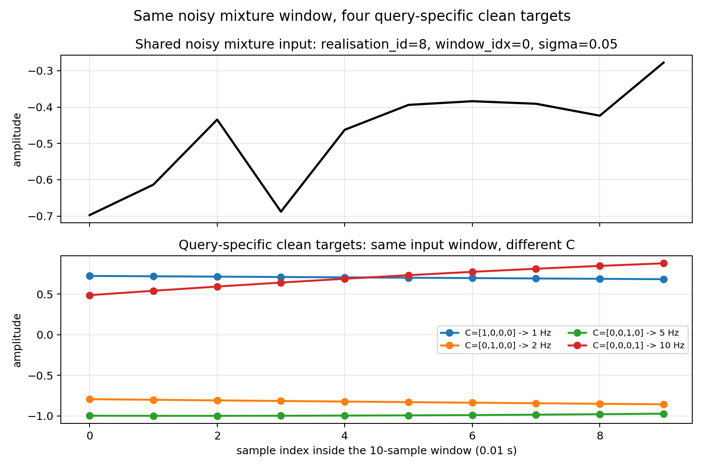
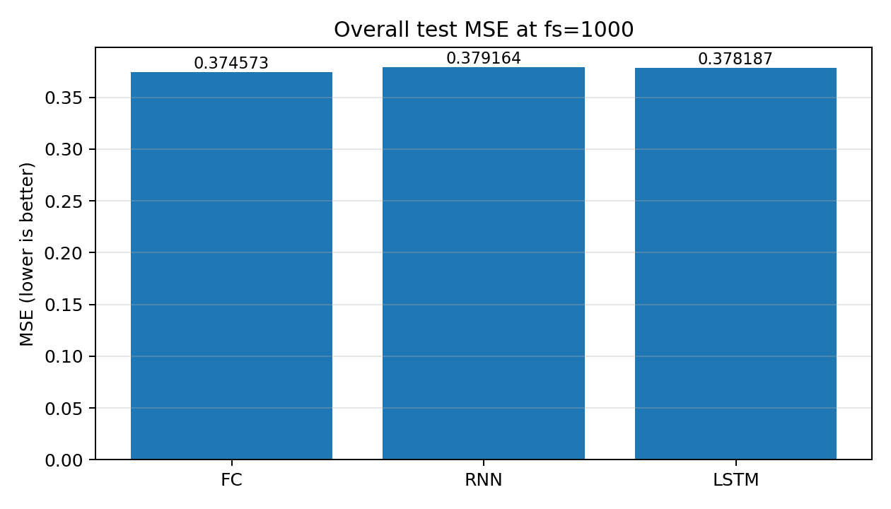
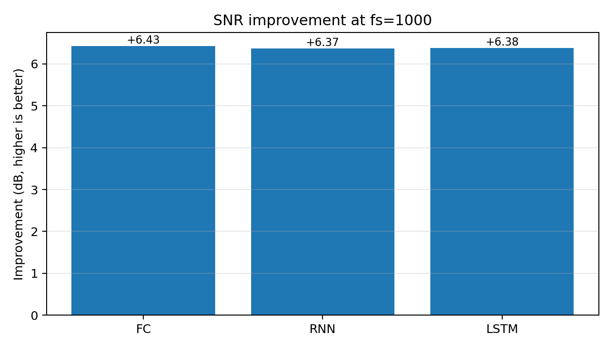
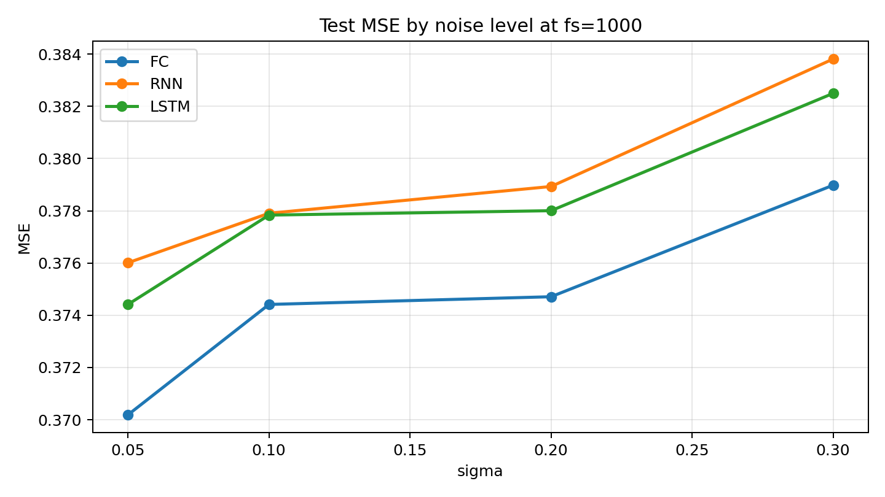
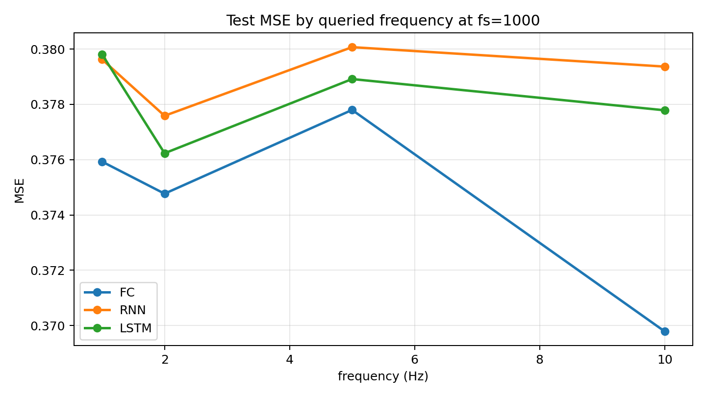

# Conditional Component Extraction from a Noisy Sine Mixture — Comparing FC, RNN, and LSTM

> Course: AI Agent Orchestration and Deep Learning — Homework 1.
> Author: Mohamed Awad.
> Repository: <https://github.com/mohammedawad99/signal-denoising-fc-rnn-lstm>.

## Abstract

We compare three neural-network architectures — Fully Connected (FC), vanilla Elman RNN, and LSTM — on a controlled conditional-extraction task. The model receives a 10-sample window of a noisy mixture that sums one independently-noised realisation of each of four known frequency components, plus a one-hot query `C` selecting which component to reconstruct, and must predict the clean window of that selected component. All three models are trained on the same data with the same loss (MSE), optimiser (Adam @ `lr = 1e-3`), batch size, and 30-epoch schedule with patience-5 early stopping. The dataset is sampled at `fs = 1000 Hz` for 10 s, giving 10,000 samples per realisation; non-overlapping windows of length 10 produce 1,000 mixture-windows and four query records per window, for a total of **400,000** dataset records (split 272,000 / 64,000 / 64,000 train / val / test). On the held-out 64,000 test records the FC achieves the lowest test MSE (**0.374573**, SNR improvement **+6.43 dB**), the LSTM is essentially tied (0.378187 / +6.38 dB), and the vanilla RNN is just behind (0.379164 / +6.37 dB). At this short context length each window covers only `T / fs = 0.01 s`, so every queried component fits at most 0.10 cycles inside the window; per-frequency error and per-σ error are both nearly flat across all three models, and the architectural gap collapses.

## 1. Assignment interpretation

The dataset entry pairs a noisy mixture window with the clean component identified by a one-hot query. The interpretation we adopt is:

> Each model receives `(x_noisy, C, sigma)` and predicts `y_clean` of the same length as `x_noisy`. `x_noisy` is a 10-sample window of the noisy mixture (sum of four independently-noised sine components), `C` is a one-hot vector that selects which of the four known frequencies to reconstruct, and `y_clean` is the clean window of that selected component. Training minimises `MSE(y_pred, y_clean)`.

For RNN/LSTM, `C` and `sigma` are broadcast across all 10 timesteps, so each step sees `[x_t, C, sigma] ∈ R^6`. For FC, the entire window is flattened together with `C` and `sigma` into a single `R^15` vector. The full chain of assumptions and their justifications lives in `docs/PRD.md`.

## 2. Dataset generation

For realisation `r` and component `k ∈ {0, 1, 2, 3}` (frequencies `{1, 2, 5, 10}` Hz):

```
clean_{r,k}(t) = sin(2π f_k t + φ_{r,k})
noisy_{r,k}(t) = clean_{r,k}(t) + ε_{r,k}(t),   ε_{r,k} ~ N(0, σ)
mixture_r(t)   = Σ_k noisy_{r,k}(t)
```

with `φ_{r,k} ~ Uniform[0, 2π)` re-drawn independently per realisation per frequency, and `σ` taken from the four levels listed below (a fraction of unit amplitude `A = 1`). The four per-component noise traces are independent, so the noise component of `mixture_r` has standard deviation `2 · σ · A` (variance four times each component's).

| Parameter | Value |
|---|---|
| Frequencies | `{1, 2, 5, 10}` Hz |
| Sigmas | `{0.05, 0.10, 0.20, 0.30}` (fraction of amplitude) |
| Sampling rate | `fs = 1000 Hz` |
| Duration | 10 s → **10,000** samples per mixture |
| Window length | 10 samples (= 0.01 s), **non-overlapping** |
| Windows per realisation | **1,000** |
| Realisations per σ | 25 |
| Queries per window | 4 (one per frequency) |
| Total examples | `4 σ × 25 mixtures × 1,000 windows × 4 queries = 400,000` |

Splits are stratified by `σ` at the **realisation** level (not the window level, not the query level): all `4 × 1,000 = 4,000` records belonging to one mixture stay together. Per σ stratum we use 17 / 4 / 4 mixtures for train / val / test, giving **272,000 / 64,000 / 64,000** examples in total.

The dataset is regenerated deterministically from `seed = 42` and persisted to `data/generated/dataset.npz` plus a `manifest.json` (with `dataset_version: "v2-mixture"`). Full spec in `docs/PRD_dataset.md`.

### Why these four frequencies?

With `fs = 1000 Hz` and `T = 10` samples, a single context window spans **0.01 s**. Inside that window every component completes only a small fraction of a cycle:

| f | cycles per 0.01 s window |
|---|---|
| 1 Hz | 0.01 |
| 2 Hz | 0.02 |
| 5 Hz | 0.05 |
| 10 Hz | 0.10 |

Each queried component therefore looks like a near-monotonic short arc inside the window, which is what makes the conditional-extraction task strict — the model has very little within-window periodicity to lean on. Every frequency stays safely below the Nyquist limit (500 Hz). The per-frequency analysis (§6.4) shows that this near-equal observability translates into nearly flat per-frequency error.

### Mixture-query structure

Every unique `(realisation_id, window_idx)` pair generates **four** dataset records — one per query frequency. The four records share the same `x_noisy` window (the same window of the same noisy mixture) and the same `sigma`; only `C` and `y_clean` change between them:

- record 1 has `C = [1, 0, 0, 0]` → `y_clean` is the clean **1 Hz** component window;
- record 2 has `C = [0, 1, 0, 0]` → `y_clean` is the clean **2 Hz** component window;
- record 3 has `C = [0, 0, 1, 0]` → `y_clean` is the clean **5 Hz** component window;
- record 4 has `C = [0, 0, 0, 1]` → `y_clean` is the clean **10 Hz** component window.

This is the structural reason the task is *conditional component extraction* rather than recovery of an already-isolated component: with a fixed mixture input the model has to use `C` as a query to pick the right one of four overlapping waveforms.



### Dataset correctness checks

The behaviour above is enforced by unit tests in `tests/unit/services/`:

- every `(realisation_id, window_idx)` query group has exactly four records;
- the four `C` vectors are the canonical one-hots `[1,0,0,0]`, `[0,1,0,0]`, `[0,0,1,0]`, `[0,0,0,1]`;
- `x_noisy` is identical across the four records in a group;
- `y_clean` differs across queries (otherwise the extraction would be trivial);
- splits are stratified at the **realisation** level, so all four queries × all 1,000 windows of one mixture stay together — no leakage across train, val, and test;
- a dedicated `sigma = 0` test verifies that, with no noise, `x_noisy` matches the sum of the four `y_clean` component windows within numerical tolerance for every query group, proving `x_noisy` is the combined mixture rather than any single component.

## 3. Model architectures

All three models share the external signature `forward(x_noisy, C, sigma) -> y_pred ∈ R^10`. Only the way the inputs are combined and the backbone differ.

| Model | Inputs combined | Backbone | Parameters |
|---|---|---|---|
| **FCDenoiser**   | flat `R^15` (concat of `x_noisy`, `C`, `sigma`) | `Linear(15→64) → ReLU → Linear(64→64) → ReLU → Linear(64→10)` | **5,834** |
| **RNNDenoiser**  | per-step `R^6` (broadcast `C` and `sigma` over `T`) | `nn.RNN(6, 32, tanh, batch_first=True)` + `Linear(32→1)` per step | **1,313** |
| **LSTMDenoiser** | per-step `R^6` (same as RNN) | `nn.LSTM(6, 32, batch_first=True)` + `Linear(32→1)` per step | **5,153** |

Output activation: linear (no `tanh` / `sigmoid`). The targets are real-valued samples in roughly `[-1, 1]`, so a linear head is the natural choice.

## 4. Training setup

| Hyperparameter | Value |
|---|---|
| Loss | `nn.MSELoss()` (mean over batch and time) |
| Optimiser | `torch.optim.Adam`, `lr = 1e-3` |
| Batch size | 64 |
| Max epochs | 30 |
| Early-stopping patience | 5 epochs (on validation MSE) |
| Gradient clipping | Not used in the final implementation. |
| Seed | 42 (NumPy, Python `random`, and PyTorch) |
| Device | CPU |

Each model is trained with its own `Adam` instance; the `Trainer` saves only the best-validation `state_dict` to `results/checkpoints/{model}_best.pt`, and exposes `load_best_checkpoint()` for evaluation.

Observed training behaviour (single seeded run, full schedule):

- **FC** early-stopped at epoch 7 (best at epoch 2).
- **RNN** early-stopped at epoch 8 (best at epoch 3).
- **LSTM** early-stopped at epoch 8 (best at epoch 3).

Each epoch now contains 4,250 batches of size 64 (272,000 train records), so a single epoch performs many more parameter updates than at smaller dataset sizes. Validation loss therefore plateaus within the first few epochs and patience-5 early stopping fires shortly after — the recorded "best" epoch genuinely captures where the network has settled.

## 5. Evaluation metrics

All metrics below are computed on the held-out **test** split (64,000 query records, 16,000 per σ).

- **`mse_overall`** = `mean((y_pred - y_true)²)` across every entry.
- **`mse_per_freq`** = `mse_overall` restricted to records with each query frequency.
- **`mse_per_sigma`** = `mse_overall` restricted to records with each `σ`.
- **`snr_improvement_db`** = `10 · log10(MSE(clean, noisy_mixture) / MSE(clean, predicted))`. Higher is better; `0 dB` means the prediction is no closer to the clean target than the noisy mixture itself.

## 6. Results

### 6.1 Headline metrics

| Model | Test MSE ↓ | SNR improvement (dB) ↑ | Parameters |
|---|---|---|---|
| **FC**   | **0.374573** | **+6.43** | 5,834 |
| **RNN**  | 0.379164     | +6.37     | 1,313 |
| **LSTM** | 0.378187     | +6.38     | 5,153 |





### 6.2 Per-σ test MSE

| Model | σ = 0.05 | σ = 0.10 | σ = 0.20 | σ = 0.30 |
|---|---|---|---|---|
| FC   | 0.3702 | 0.3744 | 0.3747 | 0.3790 |
| RNN  | 0.3760 | 0.3779 | 0.3789 | 0.3838 |
| LSTM | 0.3744 | 0.3778 | 0.3780 | 0.3825 |



### 6.3 Per-frequency test MSE

| Model | f = 1 Hz | f = 2 Hz | f = 5 Hz | f = 10 Hz |
|---|---|---|---|---|
| FC   | 0.3759 | 0.3748 | 0.3778 | 0.3698 |
| RNN  | 0.3796 | 0.3776 | 0.3801 | 0.3794 |
| LSTM | 0.3798 | 0.3762 | 0.3789 | 0.3778 |



### 6.4 Reconstruction example

A single test window with all three model predictions overlaid on the clean component selected by `C` and the noisy mixture window:


The figure was produced by `evaluation.report.generate_report` from the same trained checkpoints used for the tables above.

## 7. Discussion

**FC achieves the best test MSE and SNR improvement, but the gap is small.** Test MSE for FC is `0.374573`, only 1.0 % lower than LSTM's `0.378187` and 1.2 % lower than RNN's `0.379164`. SNR improvement is virtually identical at `+6.43 / +6.38 / +6.37 dB`. With a 10-sample window at `fs = 1000 Hz` — `0.01 s` of signal — the architectural advantage of any one backbone is very limited because every query target is a tiny near-monotonic arc and the input is the sum of four such arcs plus per-component noise. There is simply not much regression to be done in 10 samples.

**Per-frequency MSE is essentially flat for every model.** At fs=1000 each component fits at most 0.10 cycles in the window. This removes the strong observability gradient that would normally separate "easy" higher frequencies from "hard" lower ones, and the data confirms it: all 12 cells of the per-frequency table fall in the narrow band `[0.3698, 0.3801]`. The query `C` tells the model which frequency to reconstruct, but there is no useful in-window phase information available for any of the four queries.

**Per-σ MSE is also nearly flat.** As σ rises from 0.05 to 0.30, FC's MSE grows from `0.3702` to `0.3790` — a relative change of about 2.4 %. The recurrent models behave similarly. This indicates the structural extraction difficulty (extracting one sub-cycle component from a 10-sample mixture) dominates over the additive noise term at this context length; adding more noise barely makes the prediction worse on top of what the model is already missing.

**LSTM ≈ RNN.** Test MSE 0.378187 vs 0.379164. The gating advantage of LSTM does not measurably help when the recurrent unrolling has at most 10 steps and every target is a 0.01-second snapshot. With a single training run we do not claim this difference is statistically significant.

**Single seeded run.** All numbers come from a single (seeded, reproducible) run of each model. We do not report standard errors; multi-seed re-runs are listed in §9 as future work.

## 8. Limitations

- **Window length fixed at `T = 10`.** This is a stated part of the assignment, but at `fs = 1000` the 10-sample context is essentially a snapshot of every component (≤ 0.10 cycles per window). Architectural advantages that would require multi-cycle within-window structure cannot manifest at this horizon.
- **Synthetic data only.** Independent additive Gaussian noise summed onto perfect sinusoids; no real-world signals, no out-of-distribution frequencies, no amplitude variation, no phase coupling between components.
- **No hyperparameter search.** Each model trains once at PRD-specified defaults so the comparison stays fair across architectures, not optimal for any one of them.
- **Single training seed.** Numbers reported come from one run per model; standard error is not estimated.
- **No transformer baseline.** Out of scope for HW1.

## 9. Future work

- Increase the context window (e.g. `T = 50` or `T = 100`) to test whether recurrent gating or a larger FC head closes the gap once more in-window cycles are visible.
- Repeat training over multiple seeds and report mean and standard error per model.
- Sliding-window inference with overlap-add reconstruction to give the recurrent models a longer effective context.
- Add a `σ = 0.0` stratum in evaluation to verify each model passes a clean mixture through with negligible distortion.
- Replace independent white Gaussian noise with coloured (e.g. 1/f) noise to test whether the relative ordering changes.
- Add a small 1-D temporal-convolutional baseline as a fourth model.

## 10. How to reproduce

```bash
uv sync

# Build the v2-mixture dataset (writes data/generated/dataset.npz + manifest.json).
uv run python -m sine_denoising.sdk.build_dataset

# Train each architecture in turn (writes results/checkpoints/{model}_best.pt).
uv run python -m sine_denoising.sdk.train --model fc
uv run python -m sine_denoising.sdk.train --model rnn
uv run python -m sine_denoising.sdk.train --model lstm

# Evaluate on the test split (writes results/summary.json + a reconstruction PNG).
uv run python -m sine_denoising.sdk.evaluate

# Quality gate.
uv run pytest -q
uv run ruff check .
uv run mypy src
```

The dataset, checkpoints, and `results/summary.json` are gitignored. The figures used in this README are committed under `assets/report/`.

## 11. Repository structure

```
.
├── assets/
│   ├── report/                # final figures committed for the lab report
│   └── generated/             # transient evaluator output — gitignored
├── config/                    # YAML configs (dataset, training)
├── data/
│   └── generated/             # built dataset (.npz + manifest.json) — gitignored
├── docs/
│   ├── ASSIGNMENT_NOTES.md
│   ├── PRD.md                 # top-level PRD
│   ├── PRD_dataset.md         # dataset spec
│   ├── PRD_models.md          # model + training spec
│   ├── PLAN.md                # implementation plan
│   └── TODO.md                # phase-by-phase checklist
├── results/                   # checkpoints + summary.json — gitignored
├── src/sine_denoising/
│   ├── shared/                # config (pydantic), seeding, types
│   ├── services/              # signal generation, encoding, mixtures, dataset builder/loader
│   ├── models/                # base + fc + rnn + lstm
│   ├── training/              # loops + Trainer (early stopping + checkpoints)
│   ├── evaluation/            # metrics, plotting, report generator
│   └── sdk/                   # CLI entry points (build_dataset, train, evaluate)
├── tests/
│   ├── unit/                  # mirrors src/
│   └── integration/           # reserved for end-to-end smoke tests
├── pyproject.toml
├── README.md                  # this file
└── uv.lock
```
